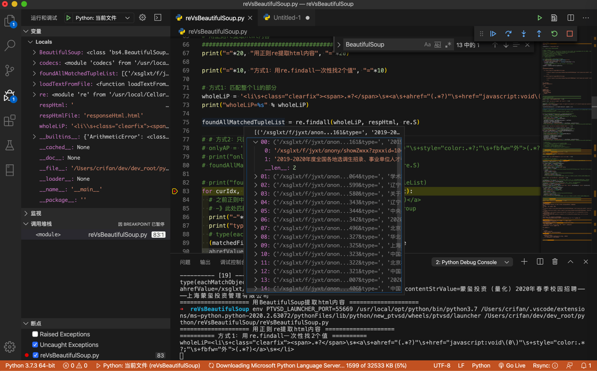
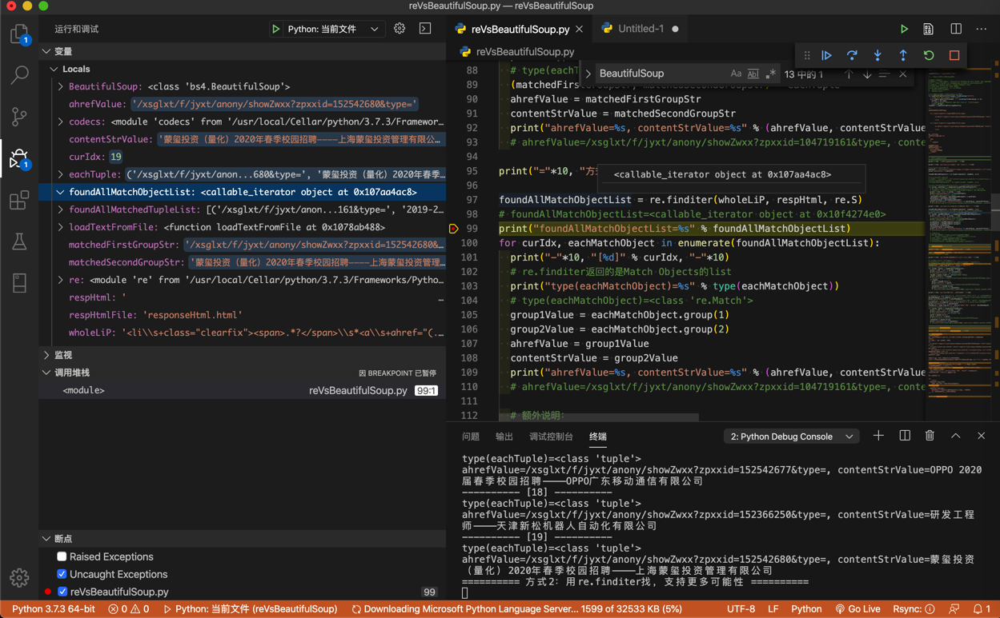
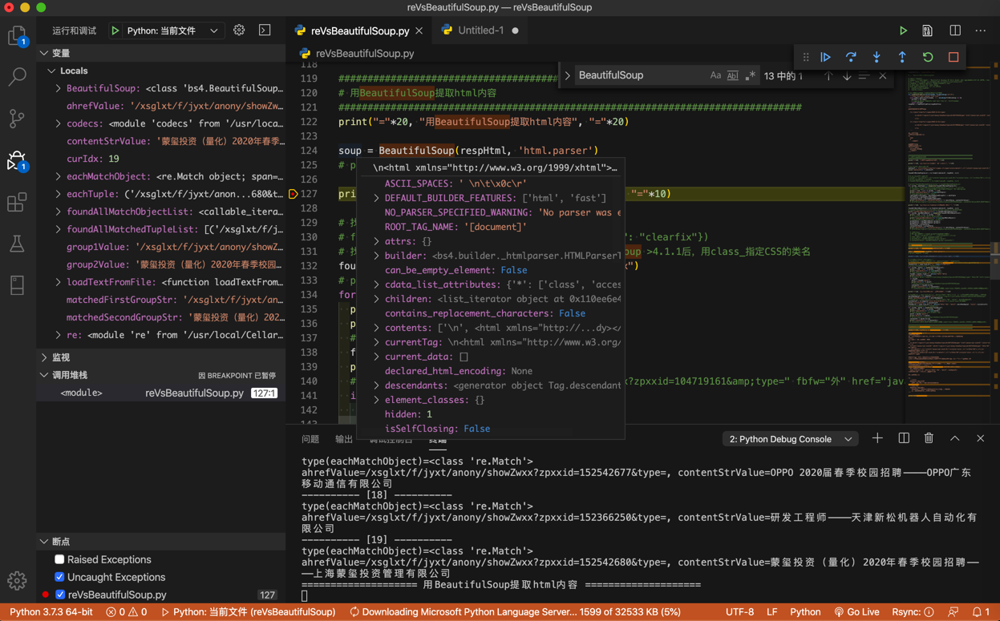
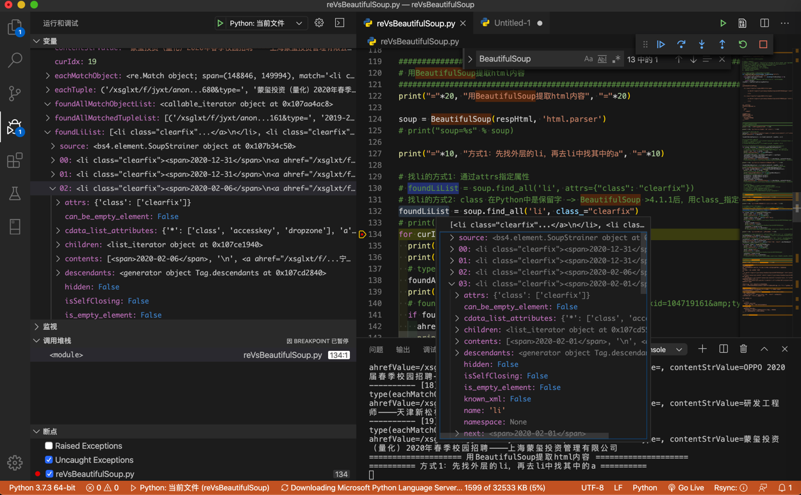
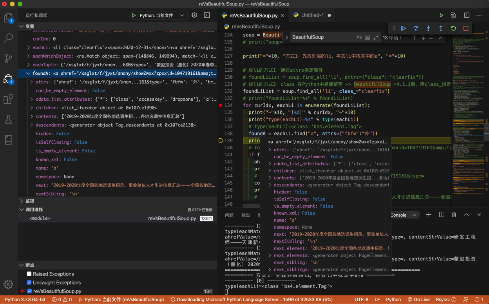

# BeautifulSoup和re详细对比

下面就通过具体的例子，即：

以之前回复的[这个帖子](https://bbs.csdn.net/topics/395845984)，来详细解释：

* 如何从HTML中提取所需内容
  * BeautifulSoup的写法
    * `find`的用法
    * `find_all`的用法
  * re正则的写法
    * `re.findall`的用法
    * `re.finditer`的用法

详细代码如下：

```python
# Function: 通过对比说明如何用BeautifulSoup和正则re去提取html中的内容
#   举例所用需求来自此帖：
#     python正则表达式提取空列表-CSDN论坛
#     https://bbs.csdn.net/topics/395845984
#   后已经整理至教程：
#     网页解析利器：BeautifulSoup
#     http://book.crifan.com/books/html_parse_tool_beautifulsoup/website
# Author: Crifan Li
# Update: 20200216

import codecs
from bs4 import BeautifulSoup
import re

respHtmlFile = "responseHtml.html"

# 第一次：初始化，保存html到文件
import requests
headers = {'User-Agent': 'Mozilla/5.0 (Windows NT 10.0; Win64; x64) AppleWebKit/537.36 (KHTML, like Gecko) Chrome/80.0.3987.106 Safari/537.36'}
url = 'http://career.cic.tsinghua.edu.cn/xsglxt/f/jyxt/anony/xxfb'
respHtml = requests.get(url, headers=headers).text
# save html to file for later debug
with open(respHtmlFile, "w") as htmlFp:
  htmlFp.write(respHtml)
  htmlFp.close()

# # 后续调试：从文件中读取html代码，方便调试
# def loadTextFromFile(fullFilename, fileEncoding="utf-8"):
#   """load file text content from file"""
#   with codecs.open(fullFilename, 'r', encoding=fileEncoding) as fp:
#     allText = fp.read()
#     # logging.debug("Complete load text from %s", fullFilename)
#     return allText
# respHtml = loadTextFromFile(respHtmlFile)

"""
【要处理的html的源码】

	<li class="clearfix"><span>2020-12-31</span>
		                                                                                                                                                                                                                                            
  			<a ahref="/xsglxt/f/jyxt/anony/showZwxx?zpxxid=104719161&type=" href="javascript:void(0)" style="color:#ff0000;" fbfw="外">2019-2020年度全国各地选调生招录、事业单位人才引进信息汇总————全国各地选调生信息汇总</a>
 			                                             
        </li>                                                                                                                                                                                                                                                                        
	                                                                                                                                                                                                                    
	<li class="clearfix"><span>2020-12-31</span>
		                                                                                                                                                                                                                                            
  			<a ahref="/xsglxt/f/jyxt/anony/showZwxx?zpxxid=41174064&type=" href="javascript:void(0)" style="color:#ff0000;" fbfw="外">学术就业相关资讯————清华大学学生职业发展指导中心</a>
 			                                             
        </li>   
  ...

【背景解释】
上述html元素结构是：
li
  span
  a
    中文文字

【需求说明】
假如要提取的是：
每个li中a的：
  ahref的链接地址
  中文文字
"""

################################################################################
# 用正则re提取html内容
################################################################################
print("="*20, "用正则re提取html内容", "="*20)

print("="*10, "方式1：用re.findall一次性找2个值", "="*10)

# 方式1：匹配整个li的部分
wholeLiP = '<li\s+class="clearfix"><span>.*?</span>\s*<a\s+ahref="(.*?)"\s+href="javascript:void\(0\)"\s+style="color:.*?;"\s+fbfw="外">(.*?)</a>\s*</li>'
print("wholeLiP=%s" % wholeLiP)

foundAllMatchedTupleList = re.findall(wholeLiP, respHtml, re.S)

# # 方式2：只匹配a的部分
# onlyAP = '<a\s+ahref="(.*?)"\s+href="javascript:void\(0\)"\s+style="color:.*?;"\s+fbfw="外">(.*?)</a>'
# print("onlyAP=%s" % onlyAP)
# foundAllMatchedTupleList = re.findall(onlyAP, respHtml, re.S)

# print("foundAllMatchedTupleList=%s" % foundAllMatchedTupleList)
for curIdx, eachTuple in enumerate(foundAllMatchedTupleList):
  # 之前正则中有2个括号，对应2个group组：ahref="(.*?)"，和 >(.*?)</a>
  # -》此处匹配到的值是个tuple元素，是2个元素，分别对应着之前的2个group
  print("-"*10, "[%d]" % curIdx, "-"*10)
  print("type(eachTuple)=%s" % type(eachTuple))
  # type(eachTuple)=<class 'tuple'>
  (matchedFirstGroupStr, matchedSecondGroupStr) = eachTuple
  ahrefValue = matchedFirstGroupStr
  contentStrValue = matchedSecondGroupStr
  print("ahrefValue=%s, contentStrValue=%s" % (ahrefValue, contentStrValue))
  # ahrefValue=/xsglxt/f/jyxt/anony/showZwxx?zpxxid=104719161&type=, contentStrValue=2019-2020年度全国各地选调生招录、事业单位人才引进信息汇总————全国各地选调生信息汇总

print("="*10, "方式2：用re.finditer找，支持更多可能性", "="*10)

foundAllMatchObjectList = re.finditer(wholeLiP, respHtml, re.S)
# foundAllMatchObjectList=<callable_iterator object at 0x10f4274e0>
print("foundAllMatchObjectList=%s" % foundAllMatchObjectList)
for curIdx, eachMatchObject in enumerate(foundAllMatchObjectList):
  print("-"*10, "[%d]" % curIdx, "-"*10)
  # re.finditer返回的是Match Objects的list
  print("type(eachMatchObject)=%s" % type(eachMatchObject))
  # type(eachMatchObject)=<class 're.Match'>
  group1Value = eachMatchObject.group(1)
  group2Value = eachMatchObject.group(2)
  ahrefValue = group1Value
  contentStrValue = group2Value
  print("ahrefValue=%s, contentStrValue=%s" % (ahrefValue, contentStrValue))
  # ahrefValue=/xsglxt/f/jyxt/anony/showZwxx?zpxxid=104719161&type=, contentStrValue=2019-2020年度全国各地选调生招录、事业单位人才引进信息汇总————全国各地选调生信息汇总

  # 额外说明：
  # 如果你前面正则中是named group带命名的组，比如：
  # ... ahref="(?P<ahref>.*?)" ... >(?P<contentStr>.*?)</a>
  # 那么也可以通过group name组名去获取值：
  # ahrefValue = eachMatchObject.group("ahref")
  # contentStrValue = eachMatchObject.group("contentStr")

################################################################################
# 用BeautifulSoup提取html内容
################################################################################
print("="*20, "用BeautifulSoup提取html内容", "="*20)

soup = BeautifulSoup(respHtml, 'html.parser')
# print("soup=%s" % soup)

print("="*10, "方式1：先找外层的li，再去li中找其中的a", "="*10)

# 找li的方式1：通过attrs指定属性
# foundLiList = soup.find_all('li', attrs={"class": "clearfix"})
# 找li的方式2：class 在Python中是保留字 -> BeautifulSoup >4.1.1后，用class_指定CSS的类名
foundLiList = soup.find_all('li', class_="clearfix")
# print("foundLiList=%s" % foundLiList)
for curIdx, eachLi in enumerate(foundLiList):
  print("-"*10, "[%d]" % curIdx, "-"*10)
  print("type(eachLi)=%s" % type(eachLi))
  # type(eachLi)=<class 'bs4.element.Tag'>
  foundA = eachLi.find("a", attrs={"fbfw":"外"})
  print("foundA=%s" % foundA)
  # foundA=<a ahref="/xsglxt/f/jyxt/anony/showZwxx?zpxxid=104719161&amp;type=" fbfw="外" href="javascript:void(0)" style="color:#ff0000;">2019-2020年度全国各地选调生招录、事业单位人才引进信息汇总————全国各地选调生信息汇总</a>
  if foundA:
    ahref = foundA["ahref"]
    print("ahref=%s" % ahref)
    # ahref=/xsglxt/f/jyxt/anony/showZwxx?zpxxid=104719161&type=
    contentStr = foundA.string
    print("contentStr=%s" % contentStr)
    # contentStr=2019-2020年度全国各地选调生招录、事业单位人才引进信息汇总————全国各地选调生信息汇总

print("="*10, "方式2：直接找a，加上限定条件", "="*10)

# foundAList = soup.find_all('a', attrs={"fbfw":"外"}) # 只加上一个fbfw的限定条件，此处也是可以的
ahrefNonEmptyP = re.compile("\S+") # ahref="/xsglxt/f/jyxt/anony/showZwxx?zpxxid=104719161&type="
print("ahrefNonEmptyP=%s" % ahrefNonEmptyP)
# foundAList = soup.find_all('a', attrs={"fbfw":"外", "ahref": ahrefNonEmptyP})
styleColorP = re.compile("color:#[a-zA-Z0-9]+;") # style="color:#ff0000;"
print("styleColorP=%s" % styleColorP)
foundAList = soup.find_all('a', attrs={"fbfw":"外", "ahref": ahrefNonEmptyP, "style": styleColorP})
# print("foundAList=%s" % foundAList)
for curIdx, eachA in enumerate(foundAList):
  print("-"*10, "[%d]" % curIdx, "-"*10)
  print("type(eachA)=%s" % type(eachA))
  # type(eachA)=<class 'bs4.element.Tag'>
  ahref = eachA["ahref"]
  print("ahref=%s" % ahref)
  # ahref=/xsglxt/f/jyxt/anony/showZwxx?zpxxid=104719161&type=
  contentStr = eachA.string
  print("contentStr=%s" % contentStr)
  # contentStr=2019-2020年度全国各地选调生招录、事业单位人才引进信息汇总————全国各地选调生信息汇总

################################################################################
# 对比：re vs BeautifulSoup
################################################################################
print("="*20, "对比：re vs BeautifulSoup", "="*20)

reVsBeautifulSoup = """
re正则的缺点：
万一html源代码改动了，即使改动很小，则之前已有的re正则表达式就失效了
举例：
只是a的属性的顺序变化一点点
从
  <a ahref="/xsglxt/f/jyxt/anony/showZwxx?zpxxid=104719161&type=" href="javascript:void(0)" style="color:#ff0000;" fbfw="外">2019-2020年度全国各地选调生招录、事业单位人才引进信息汇总————全国各地选调生信息汇总</a>
改为：
  <a href="javascript:void(0)" ahref="/xsglxt/f/jyxt/anony/showZwxx?zpxxid=104719161&type=" fbfw="外" style="color:#ff0000;">2019-2020年度全国各地选调生招录、事业单位人才引进信息汇总————全国各地选调生信息汇总</a>
之前正则：
  '<a\s+ahref="(.*?)"\s+href="javascript:void\(0\)"\s+style="color:.*?;"\s+fbfw="外">(.*?)</a>'
就无效了，就要再去改为：
  '<a\s+href="javascript:void\(0\)"\s+ahref="(.*?)"\s+fbfw="外"\s+style="color:.*?;">(.*?)</a>'
才可以匹配到。

更别说，万一html中代码有其他更大的变化
甚至是部分语法不规范的html代码，re正则根本就没法写，因为太复杂，复杂到写不出来

BeautifulSoup的优点：
与之相对：上述的，html代码的小改动，比如属性值出现的顺序不同
甚至大点的变化，多出其他属性值
甚至部分语法不规范的html代码，BeautifulSoup都可以很好的内部处理掉
而之前的代码，比如：
  soup.find_all('a', attrs={"fbfw":"外", "ahref": nonEmptyP})
都可以很好的继续工作，而无需改动。

汇总起来就是：

re
  性能：好
  支持html程度：有限
    仅限于不是很复杂的，比较规整的html
BeautifulSoup
  性能：中等
  支持html程度：很好
    不仅支持复杂的html，还支持html内部元素和位置变化
    对于不规范的html也有很好的支持
"""

print(reVsBeautifulSoup)
```

## `bs`和`re`函数返回变量类型

此处调试期间，可以看到对应变量的类型：

* 正则re
  * `re.findall`返回的是匹配的元祖`tuple`的列表：**&lt;class 'tuple'&gt;**的`list`
    * 
  * `re.finditer`返回的是匹配对象`Match Object`的列表：**&lt;class 're.Match'&gt;**的`list`
    * 
* BeautifulSoup
  * `BeautifulSoup`返回的`soup`变量的详情：
    * 
  * 而`BeautifulSoup`的`find_all`返回的是标签元素的列表：**&lt;class 'bs4.element.Tag'&gt;**的`list`
    * 
  * 而`BeautifulSoup`的`find`返回的是单个标签元素：**&lt;class 'bs4.element.Tag'&gt;**
    * 

## BeautifulSoup vs 正则re

最后总结各自的优缺点：

* re
  * 性能：好
  * 支持html程度：有限
    * 仅限于不是很复杂的，比较规整的html
  * 常用函数
    * `re.search`
    * `re.findall`
    * `re.finditer`
* BeautifulSoup
  * 性能：中等
  * 支持html程度：很好
    * 不仅支持复杂的html
      * 还支持html网页源码内部元素和位置变化时，往往`bs`的代码也无需改动
    * 对于不规范的html也有很好的支持
  * 常用函数
    * `soup.find`
    * `soup.findall`
